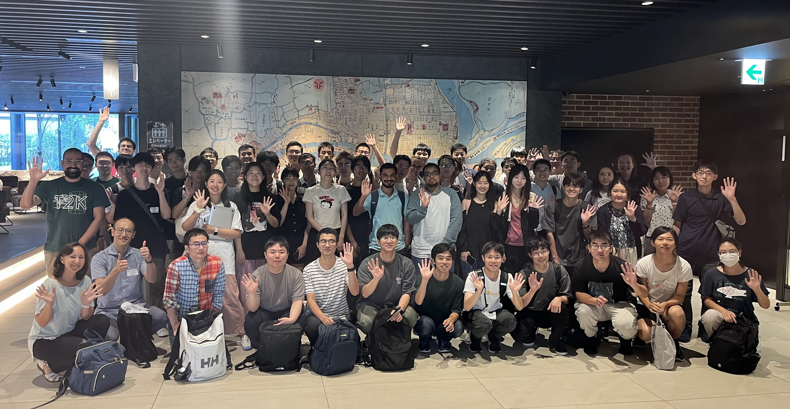
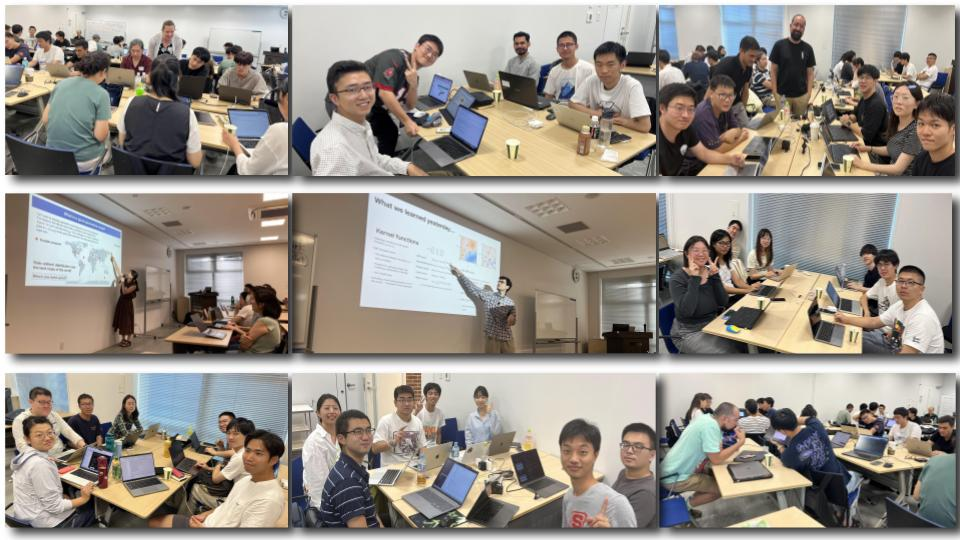

<!---->

## AstroAI Asian Network (A3 Net)
The AstroAI Asian Network (A3 Net) aims to educate students and researchers on artificial intelligence and machine learning (AI/ML) methods for astrophysics, with a focus on building a network in Asia. 

We will have our next summer school from August 18-22, 2025 in Seoul, Korea. Targeting students and early-career researchers, this one-week program includes theoretical lectures, hands-on exercises, and collaborative projects. Participants will explore the latest advancements in AI/ML techniques and their applications in solving complex astrophysical problems. 

## Information and Registration

* Time: August 18-22, 2025
* Location:  [KIAS](https://www.kias.re.kr/kias/main/main.do), Building 1 (1F), International conference room
* In-person only
* Registration deadline: June 15 2025
* Registration form: [link](https://forms.gle/4Z1K3Wt5ioQHf2wD9)
* Financial support: limited financial support is available, with priority given to junior researchers from Asian institutes.
* Contact email: kateryna.vovk@ipmu.jp
<!--- * Slack and Zoom: please find the info in the announcement email --->
<!--- List of participants --->

## Lecturers

* [Kana Moriwaki](https://www-utap.phys.s.u-tokyo.ac.jp/~moriwaki/) (University of Tokyo)
* [Leander Thiele](https://leanderthiele.github.io/) (CD3, Kavli IPMU)
* [Adrian Bayer](https://adrianbayer.github.io/)
* [Carol Cuesta-Lazaro](https://florpi.github.io/index.html)

<!--## Photo

-->

## Schedule
* Monday (Aug 18) \
TBD

* Tuesday (Aug 19) \
TBD

* Wednesday (Aug 20) \
TBD

* Thursday (Aug 21) \
TBD

* Friday (22) \
TBD

## Organizers

Jia Liu (CD3, Kavli IPMU)\
Changbom Park (KIAS)\
Kentaro Nagamine (Osaka University)\
Hironao Miyatake (KMI, Nagoya University)\
Leander Thiele (CD3, Kavli IPMU)\
Linda Blot (CD3, Kavli IPMU)\
Kateryna Vovk (CD3, Kavli IPMU)

## Co-sponsors

* [Center for Data-Driven Discovery (CD3)](https://cd3.ipmu.jp/), Kavli IPMU
* [Theoretical Joint Research (TJR) Project](https://www.phys.sci.osaka-u.ac.jp/nambu/tjr/), Osaka University
* [Fudan University](https://phys.fudan.edu.cn/)
* [University of Hawaii](https://www.ifa.hawaii.edu/)
* [University of Hongkong](https://www.physics.hku.hk/research/research_groups/astronomy/)
* [Kavli Institute for Astronomy and Astrophysics (KIAA)](https://kiaa.pku.edu.cn/), Peking University
* [Korea Institute for Advanced Study (KIAS)](https://www.kias.re.kr/)
* [Kobayashi-Maskawa Institute for the Origin of Particles and the Universe (KMI)](https://www.kmi.nagoya-u.ac.jp/eng/), Nagoya University
* [Leung Center for Cosmology and Particle Astrophysics (LeCosPA)](https://www.lecospa.ntu.edu.tw/), National Taiwan University
* [Shanghai Jiaotong University](https://www.physics.sjtu.edu.cn/en/)
* [Shanghai Astronomical Observatory](http://english.shao.cas.cn/), Chinese Academic of Sciences
* [Tsinghua University](https://astro.tsinghua.edu.cn/)
* [University of New South Wales](https://www.unsw.edu.au/)
* Program for Fugaku: JPMXP1020230406, University of Tsukuba

Please reach out (kateryna.vovk@ipmu.jp) if you are interested in joining A3 Net.

## Acknowledgement

If you initiated, performed, or performed in part a project during the summer school, please add the following acknowledgment in your publication: "This work was initiated (or performed in part) at the AstroAI Asian Network 2025 summer school."
