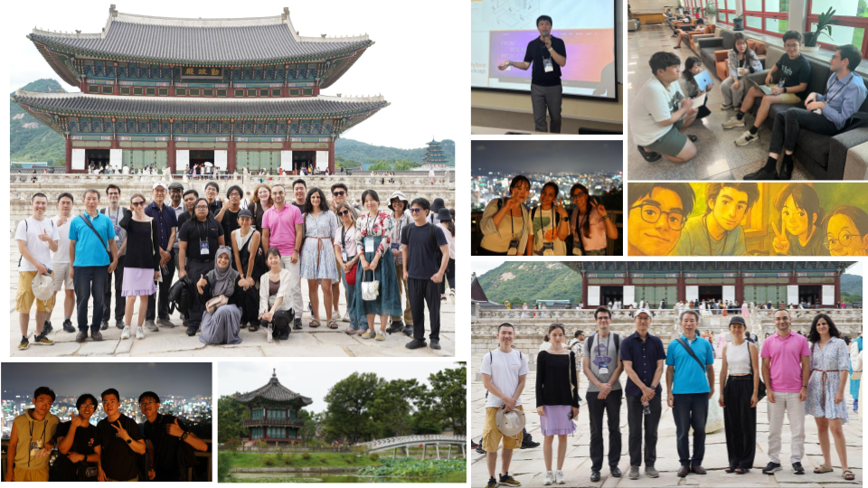
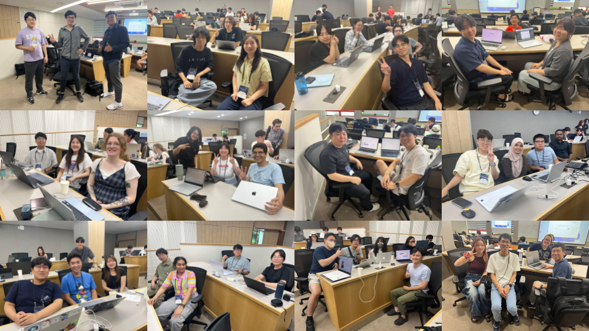

## AstroAI Asian Network (A3 Net)
The AstroAI Asian Network ([A3 Net](https://cd3.ipmu.jp/a3n)) aims to educate students and researchers on artificial intelligence and machine learning (AI/ML) methods for astrophysics, with a focus on building a network in Asia. 

We will hold our third summer school from August 24-28, 2026 in Taipei, Taiwan (ROC), hosted by **LeCosPA** and **ASIAA** (NTU). This one-week program targets students and early-career researchers and includes theoretical lectures, hands-on exercises, and collaborative projects. Participants will explore the latest advancements in AI/ML techniques and their applications in solving complex astrophysical problems. 

**Past schools**:\
[A3 Net summer school 2025](https://cd3.ipmu.jp/a3n_Aug2025) (Seoul, South Korea)\
[A3 Net summer school 2024](https://cd3.ipmu.jp/a3n_Sep2024) (Osaka, Japan)

## Information and Registration

* **Time**: Aug 24-28, 2026
* **Location**:  [LeCosPA](https://www.lecospa.ntu.edu.tw/) Auditorium, NTU (Chee-Chun Leung Cosmology Hall, No. 1, Sec. 4, Roosevelt Rd.
Taipei 10617, Taiwan, [map](https://maps.app.goo.gl/VbovjJ33HLhbmxvg6))
* **In-person only**
* **Registration deadline**: June 1, 2026
* **Registration**: [link](https://forms.gle/Eiaz5wQDucSB1vEX8)
* **Financial support**: Limited financial support is available (please indicate in the registration form), with priority given to junior researchers from Asian institutes.
* **Contacts**: 
  - ASIAA: Tomomi Sunayama (tsunayama@asiaa.sinica.edu.tw) for visa and local logistics
  - Kavli IPMU: Kateryna Vovk (kateryna.vovk@ipmu.jp) for registration and scientific programs
<!--- * Slack and Zoom: please find the info in the announcement email --->
<!--- List of participants --->

## Lecturers

* TBD

<!--!## Photo
<!--

-->

## Schedule 
<!--!(https://github.com/IPMUCD3/a3net_2026)-->

TBD

<!--### Monday (Aug 18)
* 9-9.30 Registration
* 9.30-12.30 lecture & hands on\
[Adrian Bayer: statistical modeling + intro to ML](https://github.com/IPMUCD3/a3net_2025/blob/main/Lecture_Day1_Bayer)
* 14-15 [fireslides](https://docs.google.com/presentation/d/1Wg5homy8QXrAVflASDlO8te66qzTsT6DtLtyvOJrSm4) (each participant 1min to present themselves)
* 15-17 [hack](https://github.com/IPMUCD3/a3net_2025/blob/main/Hack) introduction & group forming

### Tuesday (Aug 19)
* 9.30-12.30 lecture & hands on\
[Sungwook E. Hong: intro to deep learning](https://github.com/IPMUCD3/a3net_2025/blob/main/Lecture_Day2_Hong)
* 14-14.30 [astro research example: simulation (Ken Nagamine)](https://github.com/IPMUCD3/a3net_2025/blob/main/applications/research_simulations_Nagamine.pdf)
* 14.30- hack

### Wednesday (Aug 20)
* 9-12 lecture & hands on\
[Carol Cuesta Lazaro: generative models](https://github.com/IPMUCD3/a3net_2025/blob/main/Lecture_Day3_CuestaLazaro)
* 12- quick lunch, excursion (depart KIAS 12.30) & dinner

### Thursday (Aug 21)
* 9.30-12.30 lecture & hands on\
[Vera Maiboroda: symmetries & specialized architectures](https://github.com/IPMUCD3/a3net_2025/blob/main/Lecture_Day4_Maiboroda)
* 14-14.30 Zuofan Li & Fa Wu: industry example
* 14.30- hack

### Friday (Aug 22)
* 9.30-10 hack presentations final discussions
* 10-12.30 hack presentations
* 14-14.30 astro research example: observation (Leander Thiele)
* 14.30-16 hack presentations-->

## Organizers

Tomomi Sunayama (ASIAA, NTU)\
Daniel Baumann (LeCosPA, NTU)\
Ue-Li Pen (ASIAA, NTU)\
Ting-Wen Lan (ASIAA, NTU)\
Leander Thiele (CD3, Kavli IPMU)\
Kateryna Vovk (CD3, Kavli IPMU)\
Jia Liu (CD3, Kavli IPMU)\
Kentaro Nagamine (Osaka University)
<!--Hironao Miyatake (KMI, Nagoya University)\-->
<!--Changbom Park (KIAS, Korea Institute for Advanced Study)\-->
<!--Jae-Joon Lee (KASI, Korea Astronomy and Space Science Institute)-->

## Co-sponsors

* [Center for Data-Driven Discovery (CD3)](https://cd3.ipmu.jp/), Kavli IPMU
* [The Academia Sinica Institute of Astronomy and Astrophysics (ASIAA)](https://www.asiaa.sinica.edu.tw/), National Taiwan University
* [Leung Center for Cosmology and Particle Astrophysics (LeCosPA)](https://www.lecospa.ntu.edu.tw/), National Taiwan University
* [Fudan University](https://phys.fudan.edu.cn/)
* [University of Hawaii](https://www.ifa.hawaii.edu/)
* [University of Hong Kong](https://www.physics.hku.hk/research/research_groups/astronomy/)
* [Kavli Institute for Astronomy and Astrophysics (KIAA)](https://kiaa.pku.edu.cn/), Peking University
* [Kobayashi-Maskawa Institute for the Origin of Particles and the Universe (KMI)](https://www.kmi.nagoya-u.ac.jp/eng/), Nagoya University
* [Korea Institute for Advanced Study (KIAS)](https://www.kias.re.kr/)
* [Korea Astronomy and Space Science Institute (KASI)](https://www.kasi.re.kr/eng/index) 
* [University of New South Wales](https://www.unsw.edu.au/)
* [Shanghai Jiaotong University](https://www.physics.sjtu.edu.cn/en/)
* [Shanghai Astronomical Observatory](http://english.shao.cas.cn/), Chinese Academy of Sciences
* [South-Western Institute for Astronomy Research (SWIFAR)](http://www.swifar.ynu.edu.cn/)
* [Theoretical Joint Research (TJR) Project](https://www.phys.sci.osaka-u.ac.jp/nambu/tjr/), Osaka University
* [Tsinghua University](https://astro.tsinghua.edu.cn/)
* [Xiamen University](https://en.xmu.edu.cn/main.htm) 
* Program for Fugaku: JPMXP1020230406, University of Tsukuba

Please reach out (kateryna.vovk@ipmu.jp) if you are interested in joining A3 Net.

## Acknowledgment

If you initiated or carried out (in whole or in part) a project during the summer school, please add the following acknowledgment in your publication: "This work was initiated (or performed in part) at the AstroAI Asian Network 2026 summer school."
